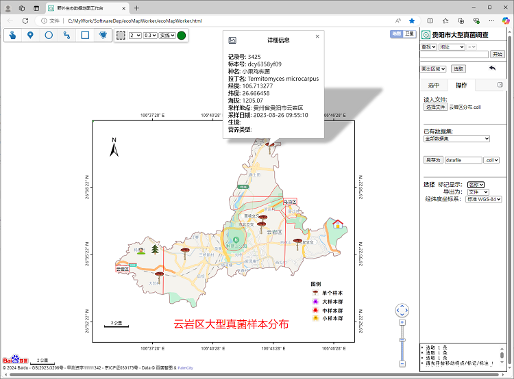
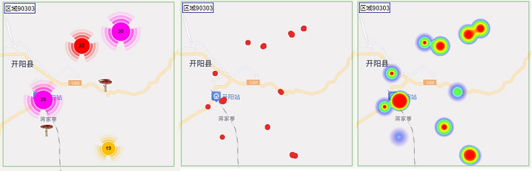
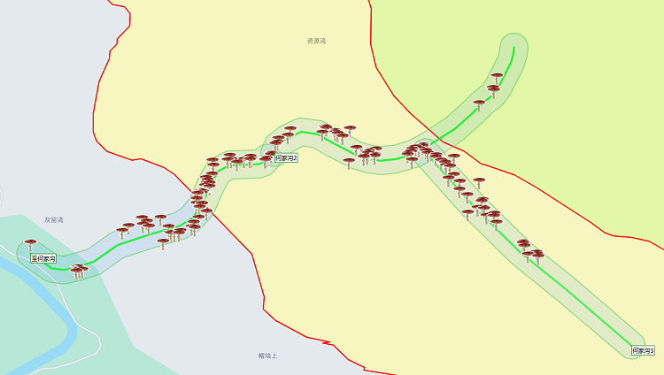
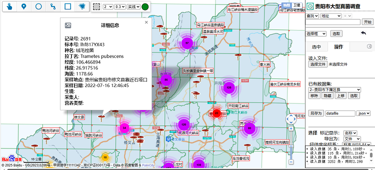
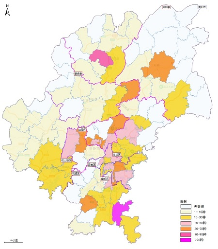
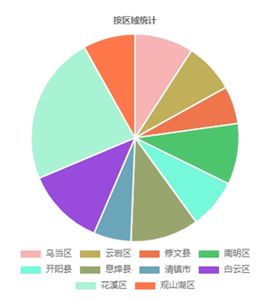
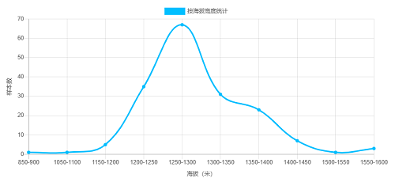
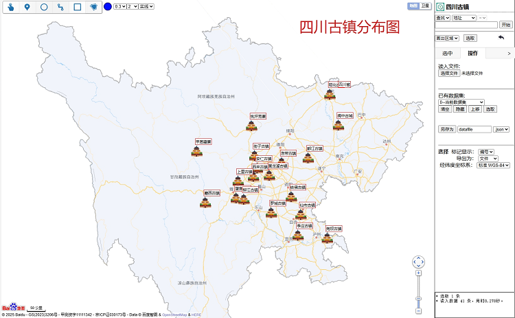
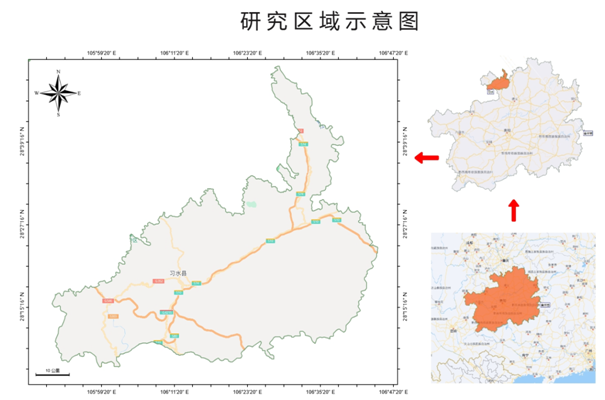

# ecoMapWorker - 野外生态数据地图工作台


## 🌍 项目简介

ecoMapWorker 是一款轻量化交互式桌面 Web GIS平台，提供地理数据可视化和分析工具，支持用户自定义地图并进行空间数据交互，以直观易懂的方式呈现数据，并特别专注于野外生态数据收集、处理及分析设计。系统支持向量数据上传（ShapeFile，KML，Geojson），轻松转换各种GIS数据格式，允许叠加多个数据层，可自定义地图符号、主题和样式，添加标签、标记，点击显示文字介绍和图片，生成针对特定需求的个性化视觉表示；并借助缓冲区生成、网格创建、聚类分析等工具进行分析统计，生成专题地图和统计图表。操作直观易懂，无需GIS专业技能。

ecoMapWorker 基于百度地图API构建，采用原生JavaScript开发，不用安装任何软件或配置服务器环境，通过浏览器即可实现数据可视化、地图标注、空间统计等功能。数据文件本地加载，不必上传服务器，保障用户数据主权。




## 目标用户

- **科研领域**：生态学家、环境科学研究者、自然保护区管理人员、野生动物保护组织成员
- **行业应用**：生态旅游规划师、野外考察项目负责人、环境监测从业人员
- **兴趣社群**：自然教育工作者、户外运动爱好者、地理信息数据发烧友
- **通用场景**：需处理位置信息的其它人员，如市场分析师、营销人员，房地产专业人员等

## 适用场景  
- 生物多样性调查与监测  
- 自然保护区规划与管理  
- 房地产、旅游、教育和规划  
- 学术研究与教学演示 

## ✨ 核心优势

### 🚀 零门槛使用
- **无需安装**: 解压即用，双击 HTML 文件即可启动
- **跨平台支持**: 完美运行于 Windows、macOS、Linux 系统
- **无依赖**: 纯前端实现，无服务器，无需配置复杂的环境
- **无专业需求**: 非GIS专业人员轻松操作
- **自由使用**: 非商业目的授权使用

### 🔒 数据安全
- **完全本地化**: 所有数据处理均在用户浏览器中完成
- **隐私保护**: 敏感数据永不离开您的计算机
- **自主控制**: 数据导入导出完全由用户掌控

### 📊 专业功能
- **全流程覆盖**: 从数据采集、处理分析到成果输出的完整工作流
- **全格式兼容**：支持 Excel、CSV、KML、GeoJSON、SHP 等主流地理数据格式
- **全坐标系支持**：经纬度坐标 WGS-84、GCJ-02、BD-09、CGCS2000，投影坐标 UTM、Web墨卡托、高斯-克吕格 
- **灵活扩展**: 支持自定义数据类型、图标库和配置方案

## 🛠️ 功能特性

### 🗺️ 地图操作模块
- **多源底图**: 支持百度2D地图和卫星影像底图切换
- **智能定位**: 地址搜索、坐标定位、行政区域定位
- **流畅浏览**: 1-18级无级缩放，鼠标右键拖拽漫游


### 📍 要素绘制编辑
- **点要素**: 自定义图标标记，支持属性信息附加、图片附加。聚合、集合、热力图等多格式展示
- **线要素**: 直线/折线/曲线绘制，自定义颜色、线宽、透明度
- **面要素**: 圆形/矩形/多边形，独立设置边框与填充样式。区域高亮显示，屏蔽区域外要素
- **图像要素**: 放大/缩小/动态调整。带坐标的照片自动定位到地图对应位置。
- **文本标注**: 自定义颜色、字体、透明度，动态调整大小
- **轻松操作**: 地图要素复制、移动、旋转、调整、组合



### 📁 数据管理
- **多格式支持**: 
  - 📊 Excel/CSV - 野外数据记录
  - 🗺️ KML/GeoJSON - 地理信息标准格式  
  - 📐 SHP - GIS 专业格式
  - 🔤 JSON - 数据交换格式
- **图层管理**: 显示/隐藏/移除/排序，支持图层叠加
- **属性编辑**: 自定义字段，编辑、筛选、排序及批量修改
- **项目管理**: 项目文件保存/加载，包括所有图层及配置信息

### 🔍 空间分析
- **基础测量**: 线段长度计算、区域面积测量
- **聚类分析**: 地理位置数据按空间距离分组
- **网格分析**: 自定义尺寸的网格生成，样本分布分析
- **时态分析**: 时间序列数据动态展示与回放
- **包含分析**: 区域包含样点、样线归集样点计算、缓冲区分析
  


### 📈 统计分析
- **多维度分析**: 按日期、区域、海拔、品种等统计
- **图表输出**: 柱状图、折线图、饼图等多种可视化
- **报表生成**: HTML统计报表，支持数据导出

### 🎨 专题制图
- **分布图制作**: 自定义区块色、渐变色、随机色方案，生成空间格局分布图、分级设色图
- **图例生成**: 自定义图例样式和标题
- **地图整饰**: 生成带经纬度刻度的图框，添加指北针、比例尺、版权标签
- **输出格式**: 截图生成JPEG、PNG等带地理配准信息的图像

## 🏁 快速开始

### 系统要求

- **操作系统**：Windows、macOS、Linux
- **浏览器**：Google Chrome、Mozilla Firefox、Microsoft Edge 等支持 Html5 的主流浏览器
- **权限设置**：允许浏览器执行 JavaScript 和弹出窗口

### 获取系统文件

1. 从官方或认证下载渠道下载 ecoMapWorker 的 ZIP 文件
2. 解压 ZIP 文件到本地磁盘的任意位置，例如 `C:\ecoMapWorker`
3. 目录结构
   ```
   ecoMapWorker/
   ├── ecoMapWorker.html      # 系统主启动页面
   ├── ecoMapConfig.js        # 系统主配置文件
   ├── README.md              # 帮助文件
   ├── pics/                  # 系统图标和图片资源
   ├── scripts/               # JavaScript 库文件
   ├── examples/              # 示例数据和应用案例
   └── images/                # 文档和说明图片
   ```

### 启动 ecoMapWorker

1. 在文件资源管理器中打开包含 `ecoMapWorker.html` 文件的目录
2. 双击 `ecoMapWorker.html` 文件，在浏览器中打开系统主界面
3. 首次启动时，根据提示设置工作台系统名称、中心城市名称和百度地图AK密钥

### 使用说明

详细使用说明请参考附带的ecoMapWork使用手册，其中包含了系统功能的详细介绍、操作步骤及示范案例。

## 🎯 应用案例

### 案例一：贵阳市大型真菌多样性调查



**项目背景:**
贵阳市生物多样性调查与评估项目（2021-2024），对全市大型真菌进行物种多样性研究。

**技术流程:**
1. **数据采集**: 使用"真菌采集"APP记录3000+样本
2. **数据导入**: GCJ-02坐标系Excel数据导入
3. **网格分析**: 115个10×10km网格划分
4. **空间统计**: 乡镇级物种丰富度分析，样线分析
5. **成果输出**: 分布图、统计图表、专题报告

**输出展示:**
- **采集样本展示**


- **按乡镇分布分级设色图**



- **按行政区统计饼图**  


- **海拔梯度分布图**




### 案例二：四川古镇文化旅游地图



**项目目标:**
制作四川省古镇分布专题图，集成位置、图片、文字介绍。

**实现步骤:**
1. **数据准备**: AI生成古镇基本信息CSV文件
2. **坐标计算**: 通过地点名称自动获取经纬度
3. **图标定制**: 设计专属古镇标记符号
4. **图文关联**: 链接图片库和文字描述
5. **专题整饰**: 添加标题、指北针

**特色功能:**
- 点击标记弹出详细信息窗口
- 图片轮播展示古镇风貌
- 分类筛选和空间查询


### 案例三：研究区域示意图



**技术要点:**
- 多级位置关系图（省-市-县）
- 经纬度图框
- 指北针和比例尺
- 关系指示箭头
- 专业标题和图例

## 🐛 常见问题解答

### Q: 系统无法加载地图怎么办？
**A:** 检查以下项目：
1. 百度地图AK是否正确配置
2. 网络连接是否正常
3. 浏览器是否允许JavaScript执行

### Q: 数据导入后不显示怎么办？
**A:** 可能的原因：
1. 坐标系设置不匹配
2. 数据格式不符合要求
3. 必需字段缺失或命名错误

### Q: 如何批量修改要素样式？
**A:** 使用以下流程：
1. 通过"选取面板"选择目标要素
2. 在"选择器"中设置新样式
3. 使用"更改-面线及标注样式"应用

### Q: 系统运行缓慢如何优化？
**A:** 建议措施：
1. 减少同时显示的图层数量
2. 使用聚合显示代替单个显示
3. 分割大数据集为多个小文件

## ⚠️ 重要声明

### 版权信息及使用许可
ecoMapWorker 软件系统由李科、邓春英、李丹开发并拥有全部知识产权。
本系统仅供非商业应用场景使用。任何商业用途需获得作者明确授权。

#### 联系方式

- **微信号**：lidangzas
- **邮箱**：lidangz@yeah.net

## 安全及免责声明

ecoMapWorker 严格遵循数据本地化原则，所有用户数据均仅限于在本机进行操作处理，不会上传至任何网络节点。同时，系统仅从百度地图官方网站获取必要的地图底图信息，确保数据来源的合法性与权威性。

用户需自行承担使用风险，对于因使用本系统产生的任何直接或间接损失，开发者不承担责任。建议用户定期备份重要数据。

## 🙏 致谢

感谢您对 ecoMapWorker 软件系统的支持和信任。如有任何建议或意见，请随时与我们联系。如需定制修改、提供个性化服务，也请联系我们。

感谢所有为 ecoMapWorker 发展做出贡献的用户和测试人员。特别感谢在项目开发过程中提供宝贵建议的科研工作者和野外调查人员。
